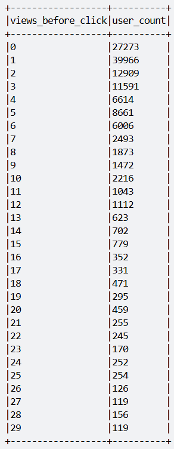

# FinalFinal

**Created:** December 27, 2024, 10:32 AM  
**Class:** My Reports

## Thông số trong Spark-Submit

| Tham số            | Giá trị  | Ý nghĩa                                |
|--------------------|----------|----------------------------------------|
| `--master`         | `yarn`   | Thực thi trên YARN                     |
| `--num-executors`  | `3`      | Số lượng executor được tạo ra để xử lý dữ liệu song song                     |
| `--executor-cores` | `4`      | Số lượng CPU cores phân bổ cho mỗi executor             |
| `--executor-memory`| `2500M`  | Bộ nhớ tối đa cấp phát cho mỗi executor      |
| `--driver-memory`  | `1G`     | Bộ nhớ cấp phát cho driver (quản lý việc điều phối task) |
|`--conf spark.driver.extraJavaOptions`| `log4j.properties`| Tham số Java để chỉ định file cấu hình log4j cho driver

---

## 1. Top 10 URL có lượt view cao nhất (PC & Mobile)

- **Mục tiêu:** Nhóm theo `domain + path`, đếm số lượng bản ghi.

### Kết quả:

**PC:**

  

**Mobile:**

 

**PC & Mobile:**

  

---

## 2. Top 10 URL có số lượng người dùng cao nhất

- **Mục tiêu:** Nhóm theo `domain + path`, đếm số lượng người dùng.

### Kết quả:

**PC:**

 

**Mobile:**

 

**PC & Mobile:**

 

---

## 3. Phân bố người dùng có hành động click

### Quy trình thực hiện:
1. Lọc user có Click.
2. Tính số View trước mỗi Click.
3. Gom nhóm và đếm số lượng user theo từng mức View.
4. Xuất bảng phân bố View trước Click.

**Ví dụ:**

| num_view | count_users |
|------------|-----------|
| 1          | 200       |
| 2          | 150       |
| 3          | 100       |
| 4          | 50        |

---

### Phân tích dữ liệu:

- **Vấn đề cần kiểm tra:** Một người dùng có thể click nhiều lần hay không.
 

- **Phân bố dữ liệu:**  

- **Histogram:**  

- **Thời gian phân tích:**  

